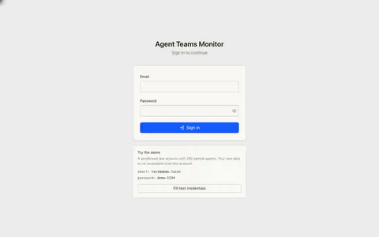
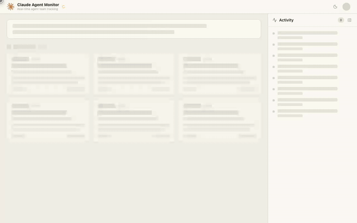
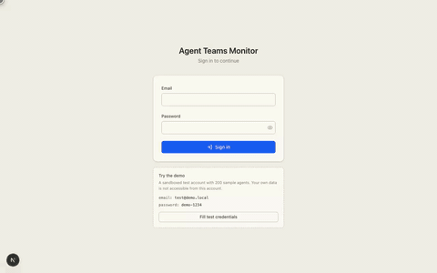
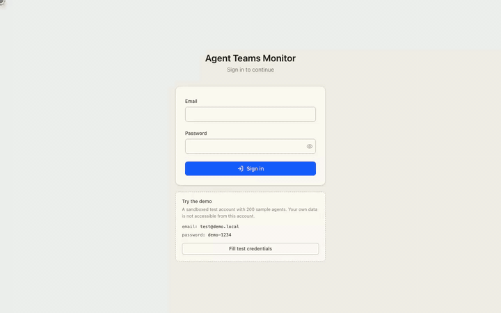

# Agent Teams Monitor

Real-time dashboard for monitoring Claude Code agents. Built on Next.js 16 + Supabase (Postgres + Realtime), deployable to Vercel.

## What it shows

Live segregated view of every Claude Code sub-agent spawned from your sessions:

- **Working** — running agents with live per-tool-use activity
- **Completed** — finished agents with duration + usage stats
- **Failed** — agents that errored

Plus a rolling activity timeline and aggregate token/tool-use totals.

## Technologies

- [Next.js](https://nextjs.org/) (App Router, React 19)
- [TypeScript](https://www.typescriptlang.org/)
- [Supabase](https://supabase.com/) (Postgres + Auth + Realtime + RLS)
- [TailwindCSS](https://tailwindcss.com/)
- [lucide-react](https://lucide.dev/) icons
- [Sonner](https://sonner.emilkowal.ski/) toasts
- [Vercel](https://vercel.com/) hosting

## Features (wait until GIFs load)

- Sign in with email + password (Supabase auth, RLS-enforced data isolation)

<p align="center"></p>

- Dashboard with skeleton loading states while data hydrates

<p align="center"></p>

- User avatar menu with account details and sign-out

<p align="center"></p>

- Light / dark theme toggle

<p align="center"></p>

- Expandable agent cards showing per-tool-use events and usage

<p align="center"></p>

- Collapsible real-time activity timeline sidebar

<p align="center"></p>

- Collapsible Working / Completed / Failed sections

<p align="center"></p>

## Architecture

```
Claude Code hooks ──POST──▶ Next.js API routes ──▶ Supabase Postgres
                                                        │
Browser dashboard ◀──── Supabase Realtime ◀─────────────┘
```

- `scripts/hook.sh` + `scripts/activity-hook.sh` — Claude Code hooks that POST to `/api/hook` and `/api/activity`.
- `/api/hook` — writes agent lifecycle events (pre/post) to `agents` + `agent_events`.
- `/api/activity` — attributes tool uses to the currently-active running agent (gap-based rotation).
- Dashboard subscribes to `agents`, `agent_events`, and `global_state` via Supabase Realtime for live updates.

## Local dev

1. Install deps:

   ```bash
   npm install
   ```

2. Copy `.env.example` → `.env.local` and fill in your Supabase keys.

3. Apply the schema in your Supabase project (SQL editor). Run the files in order:

   ```
   supabase/migrations/0001_init.sql
   supabase/migrations/0002_auth_and_scoping.sql
   ```

4. Seed a user + ingest token (plaintext token is printed once — save it):

   ```bash
   node scripts/seed-users.mjs
   ```

5. Run:

   ```bash
   npm run dev
   ```

   Dashboard is on http://localhost:7777. Sign in with the seeded user.

## Deploy to Vercel

1. Push to GitHub.
2. Import the repo into Vercel.
3. Add env vars in the Vercel project settings:
   - `NEXT_PUBLIC_SUPABASE_URL`
   - `NEXT_PUBLIC_SUPABASE_ANON_KEY`
   - `SUPABASE_SERVICE_ROLE_KEY`
4. Deploy.

## Connecting Claude Code to a deployed monitor

On the machine running Claude Code, add the monitor URL and ingest token to `~/.claude/settings.json`:

```json
{
  "env": {
    "MONITOR_URL": "https://your-app.vercel.app",
    "MONITOR_INGEST_TOKEN": "<paste the token printed by seed-users.mjs>",
    "MONITOR_PROJECT": "<short repo tag, optional>"
  },
  "hooks": {
    "PreToolUse": [
      { "matcher": "Agent", "hooks": [{ "type": "command", "command": "bash /path/to/repo/scripts/hook.sh pre" }] },
      { "matcher": ".*",    "hooks": [{ "type": "command", "command": "bash /path/to/repo/scripts/activity-hook.sh pre" }] }
    ],
    "PostToolUse": [
      { "matcher": "Agent", "hooks": [{ "type": "command", "command": "bash /path/to/repo/scripts/hook.sh post" }] },
      { "matcher": ".*",    "hooks": [{ "type": "command", "command": "bash /path/to/repo/scripts/activity-hook.sh post" }] }
    ]
  }
}
```
